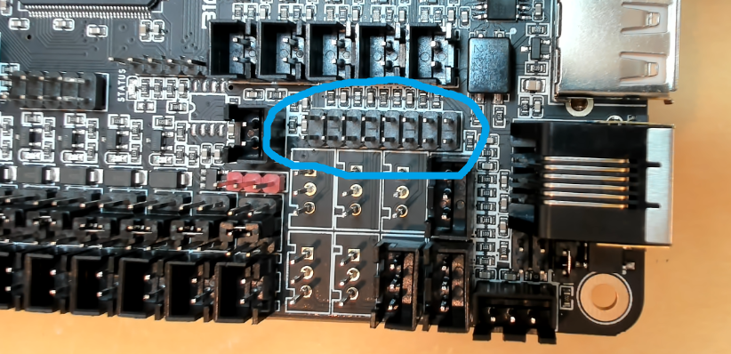
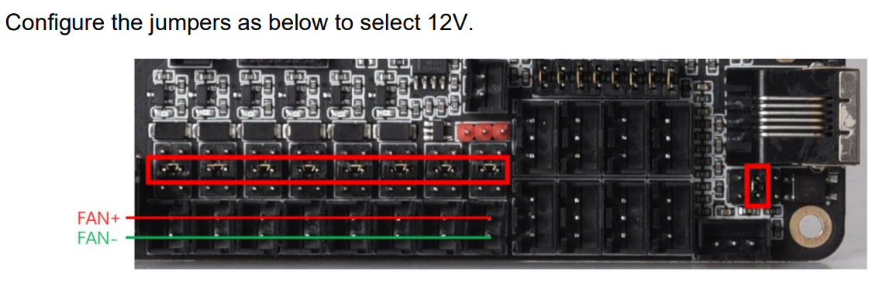
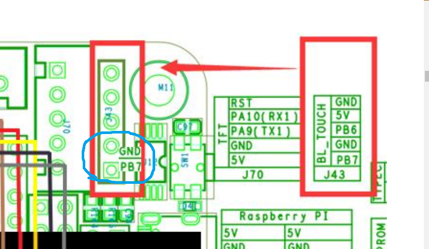
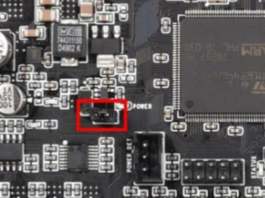
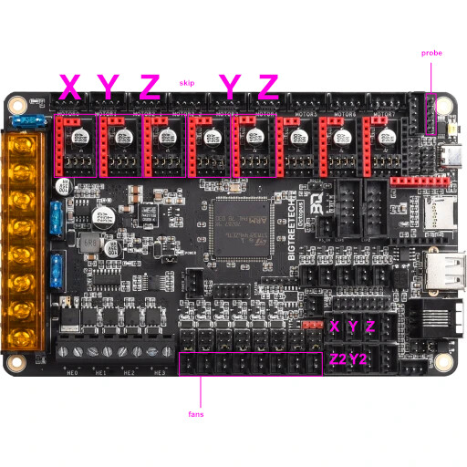

# <big><big>DO <b>NOT</b> FOLLOW THESE STEPS</big></big>- this is not complete, or tested. 


__Topic Purpose :__ 
- Share consolidated notes captured during my upgrade journey, from SKR Pro 1.2 to Octopus 1.1.  Will keep editing until done/distracted.  Found myself making notes linking to various info scattered across the forum and elsewhere.  Figured I may as well put in a bit extra effort that helps others too.
- Hoping folks, especially people who've done this already can share pictures/info/notes they have to help fill in gaps I/others have.  
- Best case scenario, community contributed content here gets absorbed into a V1E doc.  This post eventually gets deprecated and points to the V1E doc.

Thanks in advance!


# Control Boards &gt; Octopus V1.1 Assembly and Setup


## Basics
This guide walks through assembly and setup of [BigTreeTech Octopus v1.1](https://github.com/bigtreetech/BIGTREETECH-OCTOPUS-V1.0) | [User Guide](https://github.com/bigtreetech/BIGTREETECH-OCTOPUS-V1.0/blob/master/BIGTREETECH_Octopus_EN_updated_0719.pdf) | [Pins](https://github.com/bigtreetech/BIGTREETECH-OCTOPUS-V1.0/raw/master/Hardware/BIGTREETECH%20Octopus%20-%20PIN.pdf) | [Schematic](https://github.com/bigtreetech/BIGTREETECH-OCTOPUS-V1.0/raw/master/Hardware/BIGTREETECH%20Octopus.pdf)   

You can, but do NOT need to, use this 8 driver board for a stock V1E LowRider V3 (or older).  If this is a new area for you, consider going down the frequently adopted and well understood path by using [SKR Pro 1.2](https://docs.v1engineering.com/electronics/skrpro/), or Rambo, or whatever the official V1E build docs recommend.

Use an Octopus board if you're intentionally planning to go [off-piste](https://en.wikipedia.org/wiki/Backcountry_skiing) to add additional Axis and/or other functionality involving more risky fun.  Or, maybe you're using an Octopus because reasonable priced SKR Pro 1.2 is unavailable.

## Related Topics - <i><small>i.e. Recommended reading...</small></i>

- https://forum.v1e.com/t/bigtreetech-octopus-on-lowrider-v3/34226/3
- https://forum.v1e.com/t/lowrider-dual-carriage-how-to/35913
- https://forum.v1e.com/t/biqu-is-stopping-skr-pro-production-soon/33405


## Parts
- BTT Octopus 1.1
- TMC2209 Drivers
- (Optional) BTT TFT-3.5-V3
- (Optional) [ESP32U Wifi Module](https://biqu.equipment/products/esp32u-mode-esp32e-mode)
  - Read [this topic](https://forum.v1e.com/t/firmware-for-bigtreetech-esp32u-esp32e-module-for-octopus-or-skr3-skr-3-ez-skr-2/36403) covering BIQU ESP32U module flashing and config.
  - Uses esp32-wroom-32u (32Mbits = 4Mb) [specs](https://www.espressif.com/sites/default/files/documentation/esp32-wroom-32d_esp32-wroom-32u_datasheet_en.pdf)
  - [Info/Resources](../esp3d/README.md) for compiling and deploying ESP3D to BTT ESP32U Wifi Module.


## Resources / Inspiration
- Doc structure/content based on [V1E's Wiring Setup steps for SKR Pro](https://docs.v1engineering.com/electronics/skrpro/)


## Assembly / Setup

Read the User Guide BIGTREETECH_Octopus_EN_updated_0719.pdf, especially the precautions section.  Not following such precautions killed my previous board.

See @antwnvb's https://forum.v1e.com/t/bigtreetech-octopus-on-lowrider-v3/34226/4?u=azab2c 

### Disable Sensorless Pin
For SKR Pro 1.2, we would bend/cut the DIAG pin to disable (less accurate) sensorless homing.

For Octopus, do NOT bend/cut, instead we ensure jumpers are removed that connect DIAG pins to the endstop inputs for drivers, see [this](https://forum.v1e.com/t/bigtreetech-octopus-on-lowrider-v3/34226/15?u=azab2c) and [this](https://forum.v1e.com/t/biqu-is-stopping-skr-pro-production-soon/33405/44?u=azab2c).



### Driver Jumpers

Configure driver jumpers, for TMC2209 Drivers we set jumpers for UART mode.  From _3.2 in Octopus User Guide_.


## Molex and JST Connectors
Similar to https://docs.v1engineering.com/electronics/skrpro/#molex-and-jst-connectors, I ended up **very carefully** removing the JST plastic shields for 1) the drivers, 2) endstops and 3) TFT connectors.

## Fan Jumpers
24V, 12V or 5V fans are supported.  Am using 12V fans, so had to move fan jumpers.  For details, see _Octopus User Guide, section 4.1 FAN AND PROXIMITY SWITCH SETTINGS_




## Wiring Steppers


## Screen TFT35 V3 E3


## Touch Plate

Use PB7

See Octopus User Guide "2.3 BL TOUCH WIRING" for info.

https://forum.v1e.com/t/lowrider-dual-carriage-how-to/35913?u=azab2c



## Dual End Stops, End Stops 


## Wiring Power
Octopus is normally powered with wires connected to the large screw terminals.

However, IF, developing/experimenting with firmware, then Octopus can be powered vaia USB C.   providing power jumper is connected.  See 4.3 MCU POWER JUMPER




## Firmware
If new, read _User Guide 7.0, MOTHERBOARD FIRMWARE SUPPORT_ and watch https://www.youtube.com/watch?v=eq_ygvHF29I


### Updating Octopus Board with Marlin firmware

#### Edit Driver Pinout mappings 
Edit ...\Marlin\src\pins\stm32f4\pins_BTT_OCTOPUS_V1_common.h to match desired driver configuration for your build.

- Find and Update ```// Steppers```
  - For example to make the following so requires updating #define Z2_ prefixed defines, see Octopus Pinout diagram for Pin Identifiers.
    
  - 


C:\git\marlin_2.0.9.5\Marlin\Configuration.h

```c++
// The size of the printable area
#define X_BED_SIZE 49.5 * 25.4    // AZA
#define Y_BED_SIZE 25.5 * 25.4    // AZA
```

### Updating TFT firmware

### Updating ESP32 Wifi Module

https://www.espressif.com/en/support/download/other-tools


### Raspberry Pi


Pi pinout/schematics @ https://www.raspberrypi.com/documentation/computers/raspberry-pi.html

|Pi|Octopus|
| --- | --- |
| GPIO 14 (tx) | J26 PD6 (RX2) |
| GPIO 15 (rx) | J26 PD5 (TX2)|


## RGB Wiring
J37 (Red) has GND, PB0, 5V


## Cases
@jafet used SKR Pro case, [just drill new holes](
https://forum.v1e.com/t/bigtreetech-octopus-on-lowrider-v3/34226/13?u=azab2c)


<span style="display:none" hidden>
<!-- SCRATCH EDIT WORK INPROGRESS AREA -->

## Reference

BTT SKR Pro V1.2
- https://biqu.equipment/collections/control-board/products/bigtreetech-skr-pro-v1-1-32-bit-control-board?variant=29207358865506
  - Dimensions
    - Size: 147 x 95
    - Mounting: 138 x 86
  - 3D Model(s)
   - https://grabcad.com/library/bigtreetech-skr-pro-v-1-2-1 

BTT Octopus 1.1
- https://github.com/bigtreetech/BIGTREETECH-OCTOPUS-V1.0
- https://biqu.equipment/products/bigtreetech-skr-pro-v1-1-32-bit-control-board?variant=29207358865506 
  - Dimensions
  - Size: 160 x 100
  - Mounting: 150 x 90
  - 3D Model(s)
    - https://grabcad.com/library/bigtreetech-octopus-v1-1-1

BTT TFT-3.5-V3
- https://github.com/bigtreetech/BTT-TFT35-E3-V3.0

</span>
