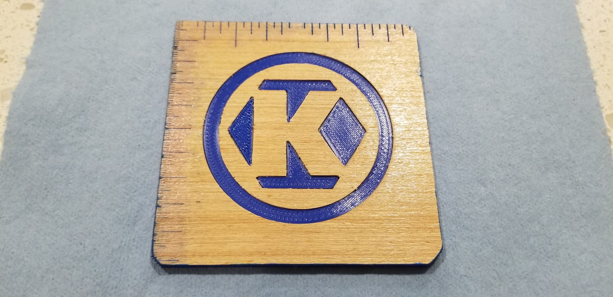
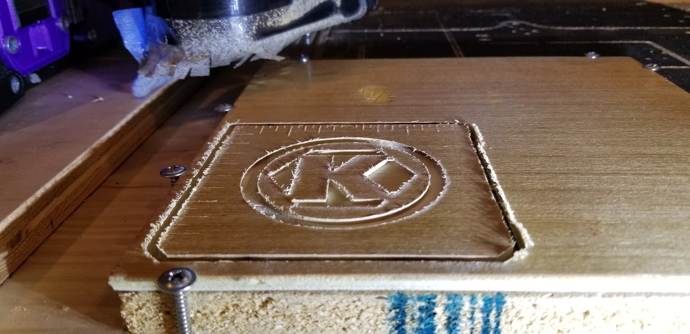
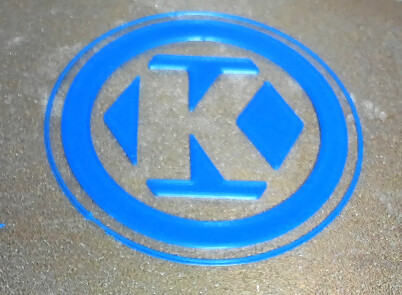
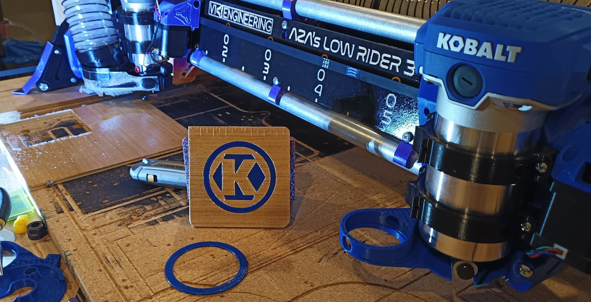

 # Coasty - CNC Calibration, Quality and Speed Test Coaster

## Purpose
- Practical small (i.e. fast) CNC and Printer project to help learn/practice calibrating CNC and Printer.  Try out pocket holes, engraving, contour cut, basic inlay, and color filling.
- Support my beverage.

## Parts / Files
- [kobalt-mat.stl](kobalt-mat.stl) model
  - [V250_kobalt-mat.3mf](V250_kobalt-mat.3mf) Cura 5.4.0 created project file, includes my printer settings.
  - [V250_kobalt-mat.gcode](V250_kobalt-mat.gcode) Printer gcode uploaded to my MP3DP for printing.
- [kobalt-mat-profile.dxf]([kobalt-mat-profile.dxf]) Mat design exported from Fusion 360 sketches I created.
- EstlCam project files:
  - [mat-engr.e10](mat-engr.e10)
  - [mat-cont.e10](mat-cont.e10) 
  - [mat-hole.e10](mat-hole.e10)
  - NOTE:  Used short file names because long filenames don't render/execute correctly on my ESP3D-Marlin setup.
  - QUESTION:  Created file per operation.  Please let me know if there's a way to have single EstlCam project file, that contains multiple layers and/or multiple groups of Cam operations.

## Related Work/Topics
- [https://forum.v1e.com/t/benchy/10124](https://forum.v1e.com/t/benchy/10124)
- [https://forum.v1e.com/t/doing-some-more-speed-testing/34972/2?u=azab2c](https://forum.v1e.com/t/doing-some-more-speed-testing/34972/2?u=azab2c)

## Assembly

- 220 grit sand smooth, vac and microfiber clean debris/dust.

- 2 coats of spray Shellac

- Pocket, Engrave, Contour…
  - Pocketed using 1.2mm Nano Blue Coat carbide bit (from 40pc set of various bits)
    - https://www.amazon.com/gp/product/B08CD99PWL/ref=ppx_yo_dt_b_search_asin_title?ie=UTF8&psc=1
  - Engraved using 30deg offset V carving carbide bit
  - Contour cut using 1/8" single flute upcut carbide bit (V1E Shop).

    

- Print PLA parts for inlay...

  

- Test fit inserting inlay parts.  Had to reprint PLA ring. Take pic far enough back to hide shoddy cleanup…

- Color fill with Acrylic paint. Needs to dry, sand clean, then Shellac again…
  - [Color Filling Techniques on Wood for Laser Engraving, CNC and Carving](https://www.youtube.com/watch?v=9WNd82-K09E)
  

- 320-400 grit Sand to remove rough edges and stains.

## Learnings

Attempt #1
- Should engrave deeper, was 0.4mm
- Adjust PLA part height and/or Pocket depth
- Adjust PLA gap for inner parts.
- Update design so 3 corners are the same, no-one is likely to use this for grouting and care that 6mm and 8mm 45deg chamfers were intentional.
- Consider heating in reflow oven to smooth PLA?

## Remarks / History
...

## Acknowledgements
...

## License/Sources
This work is licensed under a [Creative Commons (4.0 International License)
Attribution—Noncommercial—Share Alike](http://creativecommons.org/licenses/by-nc-sa/4.0/)

V1E Logos are from https://www.v1engineering.com/logos and https://docs.v1engineering.com/.  Using per https://www.v1engineering.com/license/ which was shared under [Creative Commons Attribution-NonCommercial-ShareAlike 4.0 International License](https://creativecommons.org/licenses/by-nc-sa/4.0/).
