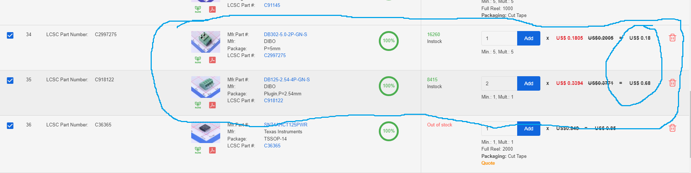

# Jackpot CNC Controller - Dev Notes

- V1 Jackpot CNC Controller v1.0
  - [Buy from V1E Shop](https://www.v1e.com/products/jackpot-cnc-controller)
  - [Docs](https://docs.v1e.com/electronics/jackpot/)
  - [v1.0 release announcement on forum](https://forum.v1e.com/t/jackpot-cnc-control-board-official-release/39575)
  - [Design updates/discussion on forum](https://forum.v1e.com/t/custom-bart-dring-fluidnc-controller/38458)
  - [Design files](https://oshwlab.com/allted/4layer-desktop-rc1_copy) (GPL 3.0)

## Components
- 74AHCT595
8-bit serial-in/serial-out or parallel-out shift register with
output latches
  - $0.37 [part](https://www.lcsc.com/product-detail/Shifting-Register_Nexperia-74AHCT595PW-118_C554707.html)
  , [datasheet](https://datasheet.lcsc.com/lcsc/2006102109_Nexperia-74AHCT595PW-118_C554707.pdf)

## FUTURES?
Curious about future features/updates.  Shared some thoughts [here](https://forum.v1e.com/t/custom-bart-dring-fluidnc-controller/38458/898?u=azab2c).

Some questions/ideas :
- What RF experts on the forum would do in terms of ESP32 placement and PCB cutouts?
- Whether elongated board vs square would affect machine builds, or PCB cost much?
  - Elongated doesn't seem to effect cost, costed a few different sizes, cost is based on area. 
- If elongated board is ok, then wondered whether MCU and drivers could be reasonably colinear/staggered for fan to cross flow cool efficiently.  Fan and vent opposite sides of case.
- Whether all/most wiring connectors could be squished to one side, to avoid wiring restricting airflow over the MCU and Drivers, and for tighter case clearances.
- Whether SD card can be on the accessible side (i.e. front/top of case), away from wiring side (i.e. back/bottom).
- Whether a single larger 3.81 pitch terminal block would be parts/assembly cheaper, stronger/more-reliable, and easier to design case around.
  - 12pin 3.81 pitch, 16-28AWG
  DIBO DB125-3.81-12P-GN-S
  https://datasheet.lcsc.com/lcsc/2304061030_DIBO-DB125-3-81-12P-GN-S_C2838108.pdf
    - Pros: Less parts, cheaper overall, more reliable.

    

- Whether the intentional nod to the V1 120 logo consumed much additional space, vs just stacking like the v1.0 board.  120 logo would take up more space, but it'd look pretty cool.  Especially with some LED bling in the middle 😀
- Whether many folks will use the expansion port, if not many will, then could leave connector off to the edge enabling smaller case for builds that don't use modules.

