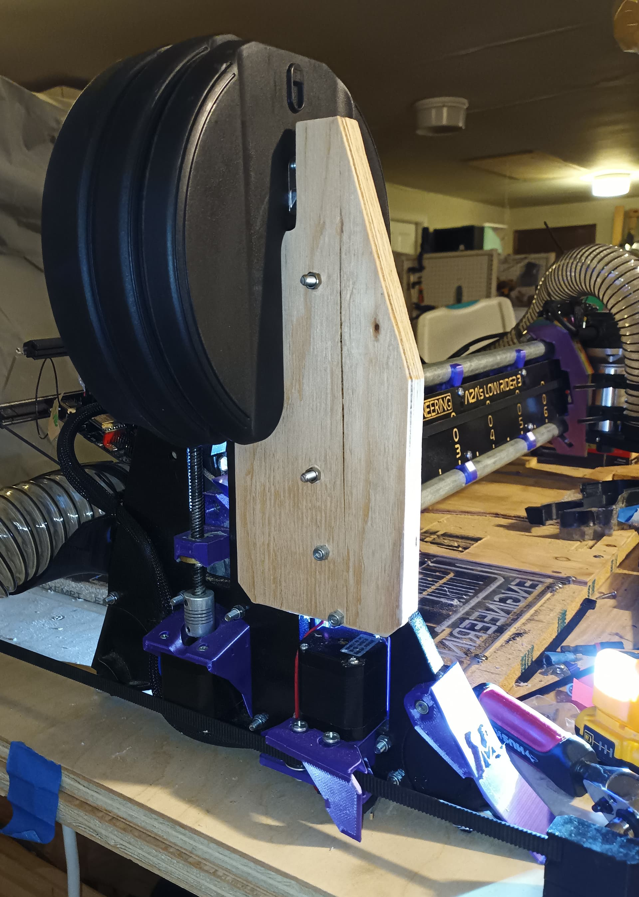
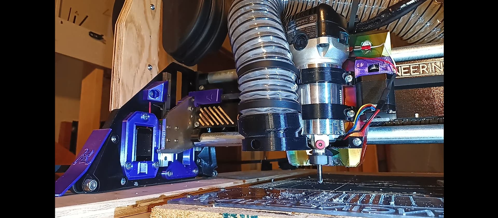
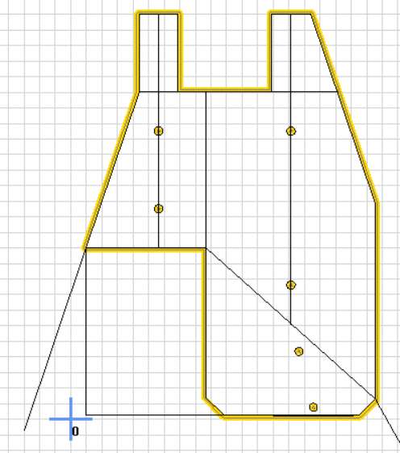
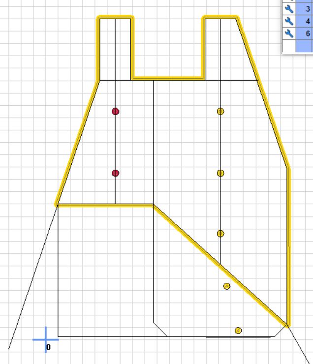

# V1E LowRider 3 mod - Bowflex mount for YZ Plates

# Problem
_Bro, does your LowRider3 eventually lift?_  Mine does, it does wheelies and bunny hops when trying to use 1/4" V-Bit 90 degree 4 flutes to carve acrylic.

# Fix
Don't use this.  Instead, do multiple passes with different bits.  Using a thinner engraving bit to channel out material to desired depth (e.g. 60 degree).  Then, use a 90 degree V Bit to carve out remaining material.

However, you might still want to use this if the machine bumps over the stock when going with fast XY feedrate.  For plastics, fast XY feedrate is needed to avoid heat causing melting/gumming, which'll lead to other problems...

For more context/details, see.. https://forum.v1e.com/t/cutting-acrylic-panels-for-mp3dp/38397/52?u=azab2c

# Parts
- Cut 1/4" or ~6mm Plywood (included [yz-bowflex-adapter-6.5mm.e10](yz-bowflex-adapter-6.5mm.e10) EstlCam file )
  
- Cut 1/2" or ~12.5mm plywoord (included [yz-bowflex-adapter-12.5mm.e10](yz-bowflex-adapter-12.5mm.e10) EstlCam file )

- 8x M5x30mm Bolts
- 8x M5mm Nylock Nuts