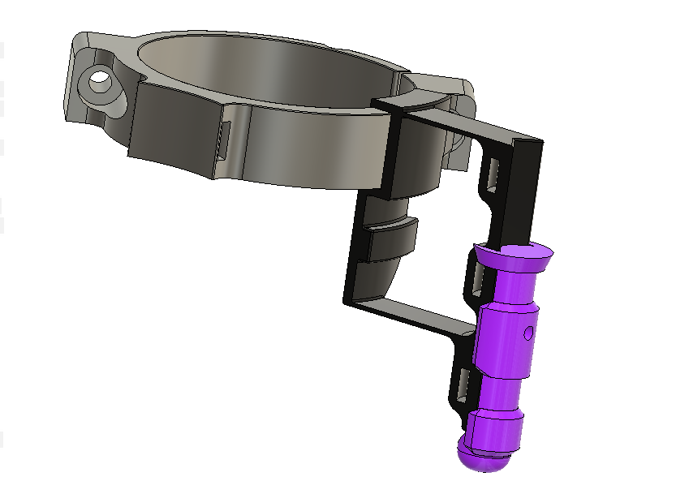
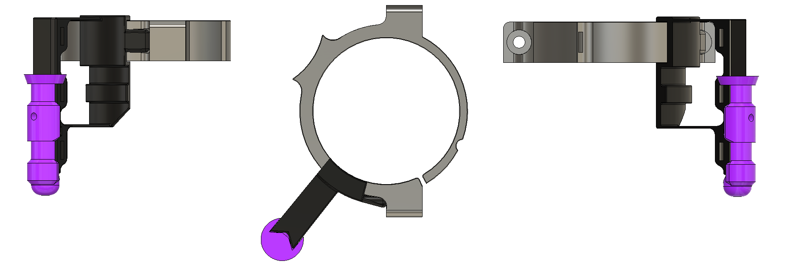
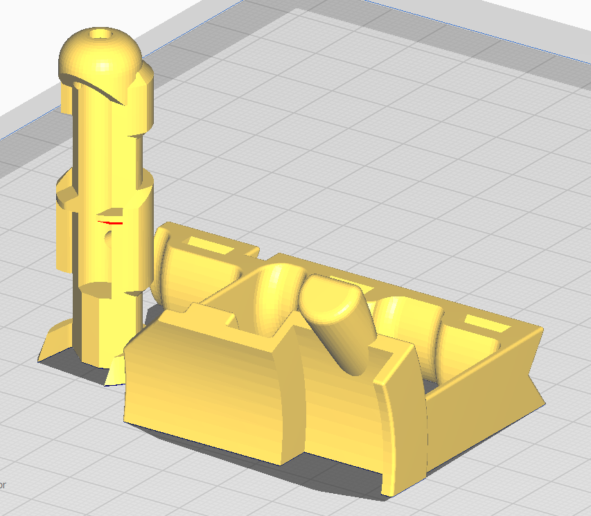
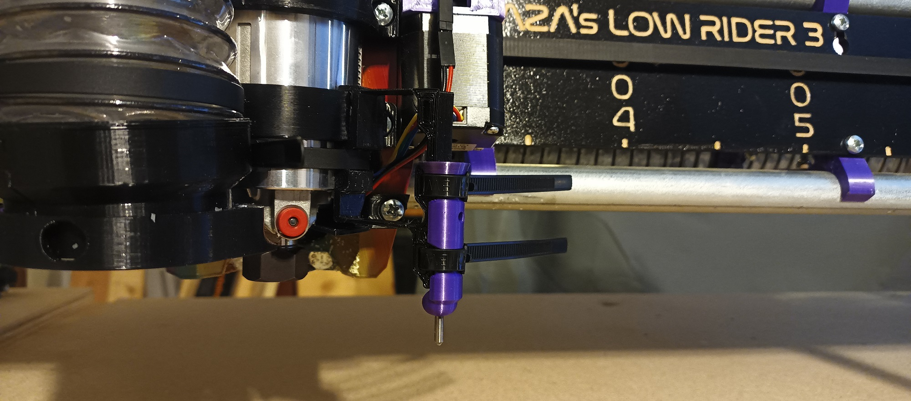
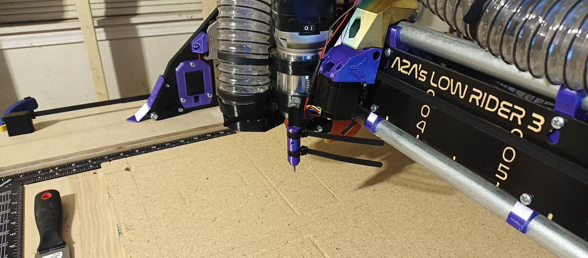

# V1E LowRider 3 mod - Pen / Drag bit mount and adaptor

## Summary

Models on [Printables](https://www.printables.com/model/419594-v1e-lowrider-3-pen-drag-knife-mount-and-adaptor), discussion on [V1E Forum](https://forum.v1e.com/t/lr3-mod-pen-drag-bit-knife-mount-and-adaptor/37182)

Mod mounts Pen, Drag bit/knife. Oversized holes for reusable zip ties. No screws/bolts needed. Leverages mount design

## Purpose / Problem

Created while trying to etch Specular Holograms, which require very shallow scratches.  Was initially using a diamond drag bit in the router, but that puts too much pressure onto the stock, and ends up engraving/gouging too deep.  So…

Looked around for existing mounts but couldn't find one that supports reusable zip ties.  Also, other mounts I stumbled onto were too high for the drag bit being used.  Am looking for something rigid in XY, but has some flex in Z axis, want to make light contact.

### Design goals/features

- Holes for reusable zip ties.  Made tight enough to hold zip ties when not in use.  No need to burn time finding some.
- Included 18mm dia, 3mm height cutout for drag knifes from V1E Shop (testing pending…)
- Mount attaches to my Makita router in specific location that:
  1) Doesn't block visibility of the bit where a gap in the dust shoes exists. 
  2) Doesn't block access to changing router bit (verify…)
- Mount shape design leverages and hugs features on the LR3 Router mount, this helps increase rigidity.  Design enables just one ziptie needed to fasten mount to the router.
- 3.3mm Diameter hole on the adapter enables push to release/remove bit.  Alternatively can use to mount something with M3 bolt.

Included .3mf with parts oriented ready for printing without support.  Print depends on small bridging and couple of small 60deg overhangs.

## See also:

- V1E's [V1E's Basic LR3 Pen mount](https://www.printables.com/model/237997-basic-lr3-pen-mount)
- Doug's [Pen Holder / Drag Knife Holder - designed for LR3 Dust Shoe (v2.0)](https://www.printables.com/model/225516-lowrider-3-cnc-add-on-pen-holder-drag-knife-holder)
- Dan's [LR3 Pen / Drag Knife Mount](https://www.printables.com/model/388240-low-rider-3-pen-drag-knife-mount)

## Future Improvements: <small>(please ping if you remix and make better, cheers!)</small>

- Could be stiffer in XY. Maybe make triange/wedge with 2 edges coming off the router mount?
- Could be looser in Z. Maybe make alternative model with thinner/narrower support arms.
- Lost Z alignment ~25mins into an engraving session, bit seems to have been pushed up somehow, scratches were noticeably lighter. So, could probably be stiffer and/or less play with higher tolerances. Not sure, mentioning as something to look out for.

## Parts:

- V1E Shop https://www.v1e.com/collections/parts/products/drag-knife-vinyl-cutter
- Ali Express https://forum.v1e.com/t/diamond-drag-engraving-tool-design/33614?u=azab2c

## Usage

- Cutting Vinyl https://www.youtube.com/watch?v=1uBo451z2AM
