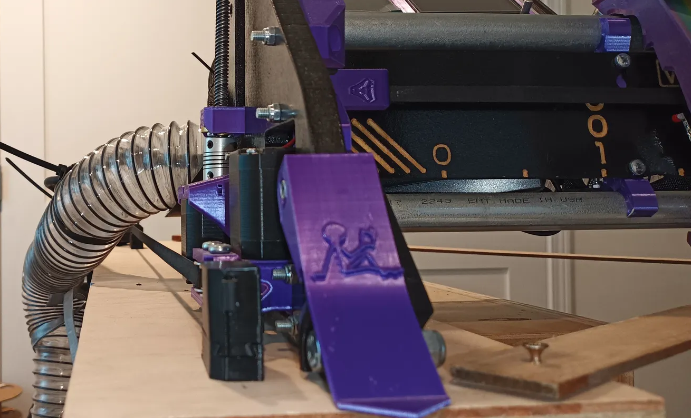
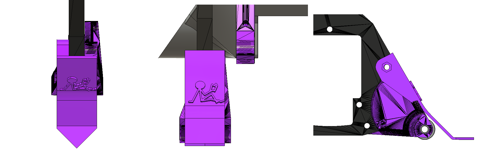
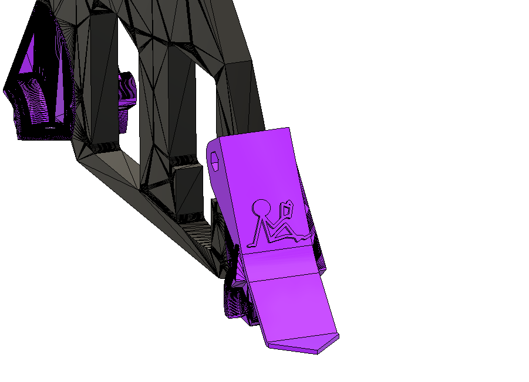
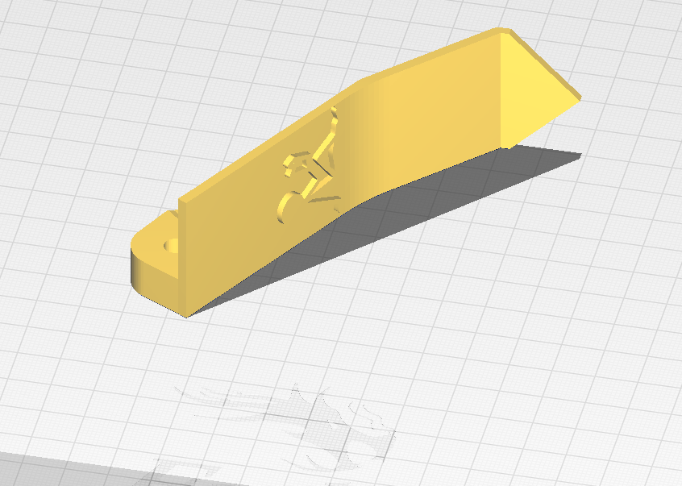

# V1E LowRider 3 mod - Almost pointless pointy dust flaps

Created a cutting edge tech plough to help divert shaving piles.  Helping avoid excess shavings in/under bearing wheels that may impact our 0.04mm Z axis accuracy.  Also shared on [Printables](https://www.printables.com/model/426176-v1e-lowrider-3-almost-pointless-pointy-dust-flaps).

More details and discussion on real solutions welcome at https://forum.v1e.com/t/lr3-mod-diverting-shaving-piles-avoid-excess-shavings-in-under-bearing-wheels-causing-inaccuracies/34020

<table><tr><td>

</td><td>

</td></tr></table>

