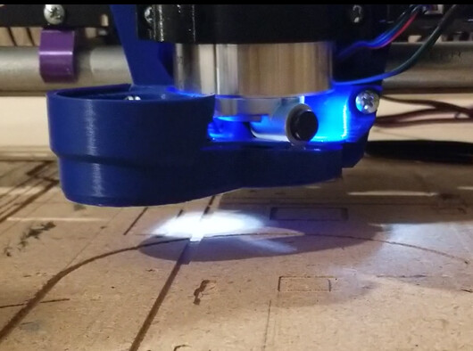
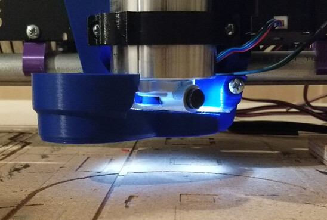
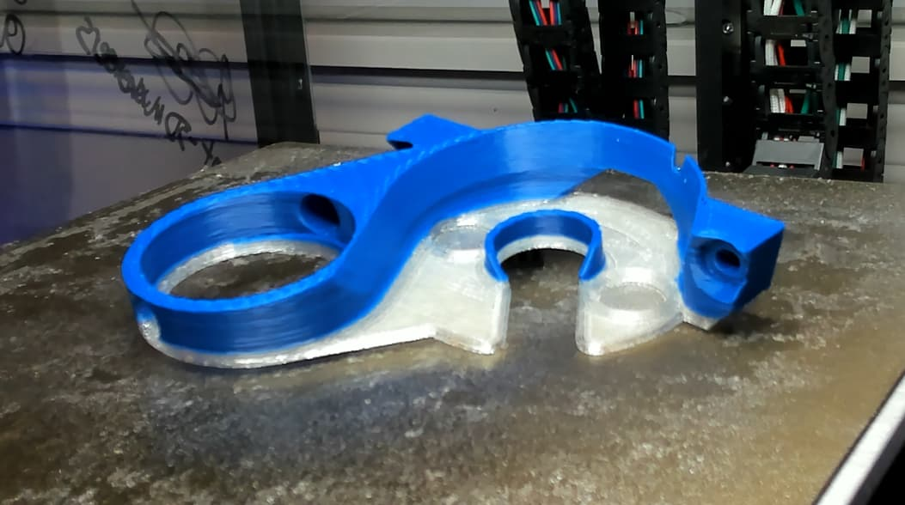

# <big>LowRider 3 — Kobalt Router LR3 Mount for Transparent PLA/PETG</big>

<table><tr>
<td>

## BEFORE... 

</td>
<td>

## AFTER...

</td>
</tr></table>

Shared on Printables [here](https://www.printables.com/model/651376-kobalt-router-lr3-mount-for-transparent-plapetg).

## Problem / Fix
Remix of [V1E/Ryan's Kobalt Vac mount](https://www.printables.com/model/628738-kobalt-router-lr3-mount), with these mods :

- Closed hole for LED, added 2 thin areas close to LEDs to help maximize light passing through.  
- Included perimeter ridges around the LED areas, goal being to maintain/increase part strength/rigidity, but not block/reduce airflow.
- Removed funnel to help increase router airflow and cooling.
- Made part less stabby, rounded corners near opening for spindle lock.

## Parts

- Download Ryan's (V1E) Kobalt Router Vac Mount files from https://www.printables.com/model/6287..., print : 
  - 2x LR3 Kobalt Tool Mount.3mf
  - 1x LR3 Kobalt Vac Bottom.3mf
- Then, for the Vac Top part, use the modified Vac Top from :
  - Printables @ https://www.printables.com/model/651376
  - Or... https://github.com/aaronse/v1engineering-mods/tree/main/lowrider3/kobalt-router-mount

- [kobalt-router-mount-vac-top.stl](./kobalt-router-mount-vac-top.stl)
- [V250_kobalt-router-mount-vac-top.gcode](./V250_kobalt-router-mount-vac-top.gcode)

- To Print...
  - Do this... https://www.youtube.com/watch?v=D2-W1aTK8xU
  - But, know pros/cons of this... https://www.youtube.com/watch?v=h_Mohd7JLzw
