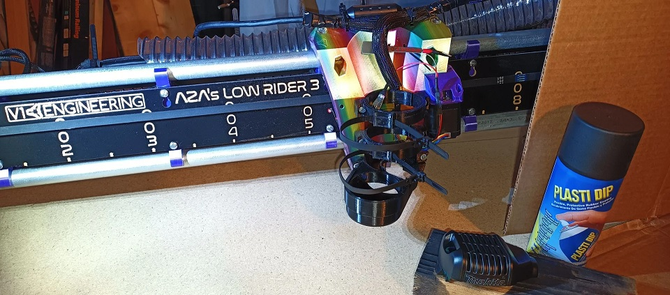

 # V1E LowRider 3 mod - Makita Tool Mount for 2-1/2" Vac Hose and XL zip ties

Published to [Printables](https://www.printables.com/model/359322-lowrider-3-cnc-makita-700-series-mount-25-xl-zip-h).

Also posted to my LR3 build topic V1Engineering [forum discussion](https://forum.v1engineering.com/t/purple-black-rainbow-lr3-build-video-https-youtu-be-fj7nyio8ooe/33309).

## Purpose
Enables using reusable zip ties to secure 2-1/2" vac hose.

## Files 
[makita-tool-mount_2.5in_xl-zip_aza_v1.stl](makita-tool-mount_2.5in_xl-zip_aza_v1.stl) 
[makita-tool-mount_2.5in_xl-zip_aza_v1.step](makita-tool-mount_2.5in_xl-zip_aza_v1.step) 

## Usage
Use this Mod when following [LR3 build docs](https://docs.v1engineering.com/lowrider) to mount Makita to LR3 core when using 2-1/2" VAC Hose, with reusable zipties.

## Acknowledgements
Remix of, and originally based-on:

- Original LR3 Makita Mount, see [V1Engineering LowRider 3 CNC](https://docs.v1engineering.com/lowrider)
- Doug Joseph's Makita 700 series mount, see [V1E Forum](https://forum.v1engineering.com/t/lowrider-v3-makita-700-series-mount-removable-dust-shoe-remixed-for-2-5-hose-v1-1/33180) and [Printables](https://www.printables.com/model/212623-lowrider-3-cnc-makita-700-series-mount-removable-d).
 

## License/Sources
This work is licensed under a [Creative Commons (4.0 International License)
Attribution—Noncommercial—Share Alike](http://creativecommons.org/licenses/by-nc-sa/4.0/)

/v1e/... files are from https://www.v1engineering.com/logos and https://docs.v1engineering.com/.  Using per https://www.v1engineering.com/license/ which was shared under [Creative Commons Attribution-NonCommercial-ShareAlike 4.0 International License](https://creativecommons.org/licenses/by-nc-sa/4.0/).
