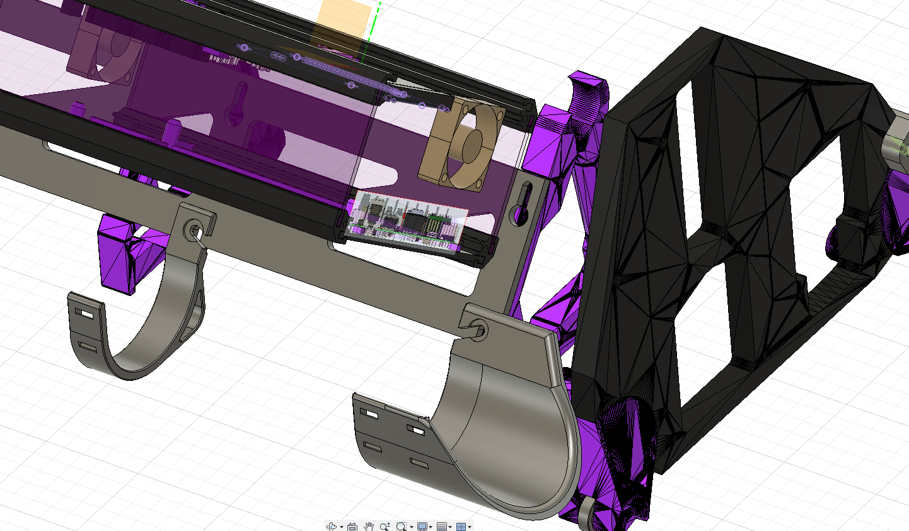
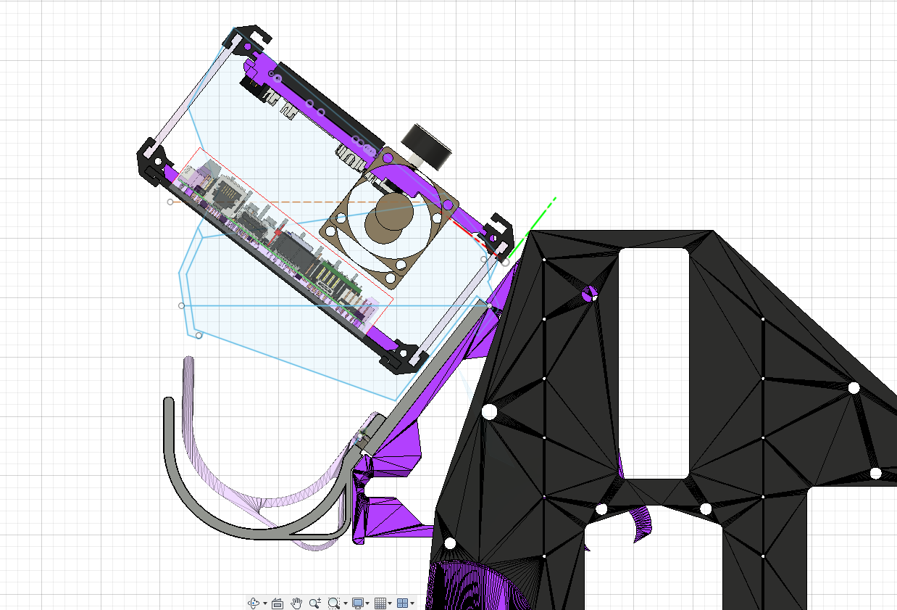

 # V1E LowRider 3 mod - Vac Hose Hangers

Solid shapes are new design.  The Pink hatched shape is the old hanger.

## Purpose
LR3 Hose Hangers for 2.5" Vac hoses, includes holes larger enough for reusable zip ties.

Created for my LR build.  My Vac hose is 2.5", stock LR3 hose hangers are for 1.5" vac hose.  Was using [Doug Joseph's 2.5 Hose Hangers](https://www.printables.com/model/218468-lowrider-3-cnc-hose-hanger-modified-for-25-vac-hos) for a while.  However, some issues bugged me...

### Problem
- My 2.5" hose seems to be slightly oversized, so they don't sit well in Doug's hose hangers.
- Am running router and controller power wires along the vac hose.  Wires are velcro'd to the hose.  Unfortunately the wires make the hose stick up out of the hangers even more so.  Not a huge deal, except that...
- Due to issues mentioned above, underside of the controller case ends up being propped up by the hose.  A raised case is loose and might even end up ruining a job if the Core crashes into the case.
- Observed hose contacting and catching on the belt and belt holder blocks.  Noticed during speed "Drag Race" tests.  Reason is wiring is velcro'd to the Vac hose, this ends up slack, dangling and vulnerable to catching on something... 

## Parts
Printed in PETG, since that's more flexible and less brittle than PLA.

## Usage

## Remarks / History

## Related Work / Acknowledgements
Remix of, and originally based-on:

- Original LR3 parts, see [V1Engineering LowRider 3 CNC](https://docs.v1engineering.com/lowrider)
- [Doug Joseph's 2.5 Hose Hangers](https://www.printables.com/model/218468-lowrider-3-cnc-hose-hanger-modified-for-25-vac-hos).

## License/Sources
This work is licensed under a [Creative Commons (4.0 International License)
Attribution—Noncommercial—Share Alike](http://creativecommons.org/licenses/by-nc-sa/4.0/)

/v1e/... files are from https://www.v1engineering.com/logos and https://docs.v1engineering.com/.  Using per https://www.v1engineering.com/license/ which was shared under [Creative Commons Attribution-NonCommercial-ShareAlike 4.0 International License](https://creativecommons.org/licenses/by-nc-sa/4.0/).
