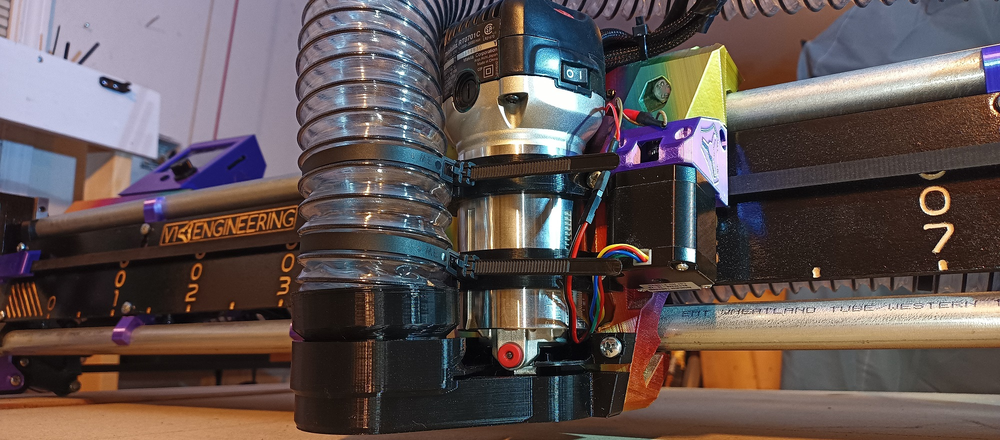

 # V1E LowRider 3 mod - Vac Hose Adapters/Mounts

## Purpose
Sharing info about the mix of LR3 Vac Hose related parts used in my build.

## Parts
- Used [Clear flexible PVC 2-1/2" vac hose](https://www.amazon.com/gp/product/B01M6C4M9J/ref=ppx_yo_dt_b_search_asin_title?ie=UTF8&psc=1) for my build.  Like most things, dimensions for hoses vary slightly between manufacturers.  
- Created/remixed [vac-hose-adapter_2.5inch.stl](vac-hose-adapter_2.5inch.stl) 
  - Created using [vac-hose-adapter_2.5inch.scad](vac-hose-adapter_2.5inch.aza.scad).  Parameterized script can be used to make Vac Adapters with/without flanges. 

- Created/remixed [makita-tool-mount](../makita-tool-mount/README.md).  Use to attach Makita router to Core, and attach Vac Hose with reusable zipties. 

- Used [Doug Joseph](https://www.youtube.com/@design8studio)'s _makita-vac-lower...stl_ and _makita-vac-upper...stl_ from [Printables](https://www.printables.com/model/212623-lowrider-3-cnc-makita-700-series-mount-removable-d). 

## Related Work
- Old V1.0 [vac-hose-adapter_2.5inch.v1.0(follymaker).scad](vac-hose-adapter_2.5inch.v1.0(follymaker).scad), from [Thingiverse by FollyMaker](https://www.thingiverse.com/thing:1246651) 
- Older V0.2 [vac-hose-adapter_2.5inch.v0.2(tokoloshe).scad](vac-hose-adapter_2.5inch.v0.2(tokoloshe).scad), snapshot discovered thanks to Philipp at [this V1E forum post](https://forum.v1engineering.com/t/vacuum-hose-size/35926/3?u=aaronse).

## Usage
The OpenScad .scad file(s) contain comments describing how to modify dimensions for your build.

Use these mods to help create a clean healthy environment.  Lung cancer and respiratory illnesses suck.

## Remarks / History

Note the files here were designed/tweaked exactly for my [LR3 build](https://www.youtube.com/watch?v=FJ7nYio8oOE).  So, you may need to tweak model(s), and/or use electrical/duct tape layer(s) to get a snug acceptably air sealed fit.

## Acknowledgements
Remix of, and originally based-on:

- Original LR3 parts, see [V1Engineering LowRider 3 CNC](https://docs.v1engineering.com/lowrider)
- Doug Joseph's Makita 700 series mount, see [V1E Forum](https://forum.v1engineering.com/t/lowrider-v3-makita-700-series-mount-removable-dust-shoe-remixed-for-2-5-hose-v1-1/33180) and [Printables](https://www.printables.com/model/212623-lowrider-3-cnc-makita-700-series-mount-removable-d).
 

## License/Sources
This work is licensed under a [Creative Commons (4.0 International License)
Attribution—Noncommercial—Share Alike](http://creativecommons.org/licenses/by-nc-sa/4.0/)

/v1e/... files are from https://www.v1engineering.com/logos and https://docs.v1engineering.com/.  Using per https://www.v1engineering.com/license/ which was shared under [Creative Commons Attribution-NonCommercial-ShareAlike 4.0 International License](https://creativecommons.org/licenses/by-nc-sa/4.0/).
