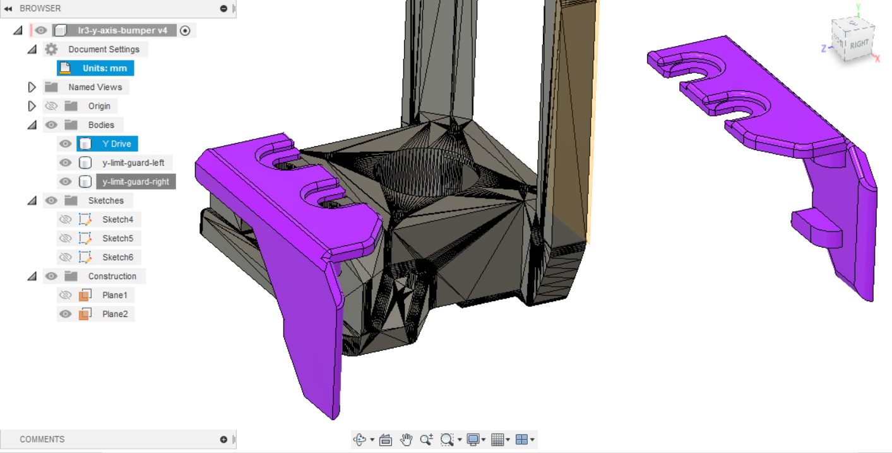
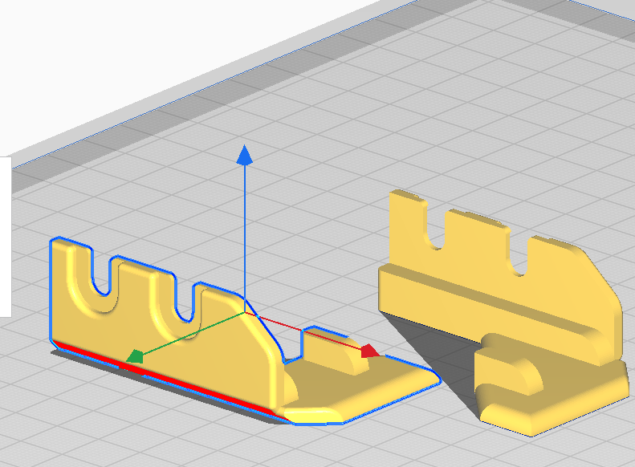

 # V1E LowRider 3 mod - Y Limit Switch Guard

New designed parts are solid purple.  The dark hatched shape is the existing LR3 Y drive mount that this mod will be attached to.

## Purpose / Problem
LR3 Y axis limit switches are proud and prone to being knocked when LR3 is being stored/relocated.  Spring metal arms on the switches often fly out and are a PITA to find and reattach.

This guard is designed to protect the limit switch, while also being very easy to mount to the existing Y drive mount.

Created for my LR3 build after spring arms came off 3+ times.

## Parts
Consider printing in PETG.  Typically, PLA is brittle and less flexible.

- [lr3-aza-y-limit-guard-left.stl](lr3-aza-y-limit-guard-left.stl)
- [lr3-aza-y-limit-guard-right.stl](lr3-aza-y-limit-guard-right.stl)

## Alternatives

See https://forum.v1e.com/t/limit-switch-arms/36804, some folks are happily using more robust hall effect switches (magnetic based).

## Related Work / Acknowledgements
Remix of, and originally based-on:

- Original LR3 parts, see [V1Engineering LowRider 3 CNC](https://docs.v1engineering.com/lowrider)

## License/Sources
This work is licensed under a [Creative Commons (4.0 International License)
Attribution—Noncommercial—Share Alike](http://creativecommons.org/licenses/by-nc-sa/4.0/)

/v1e/... files are from https://www.v1engineering.com/logos and https://docs.v1engineering.com/.  Using per https://www.v1engineering.com/license/ which was shared under [Creative Commons Attribution-NonCommercial-ShareAlike 4.0 International License](https://creativecommons.org/licenses/by-nc-sa/4.0/).
