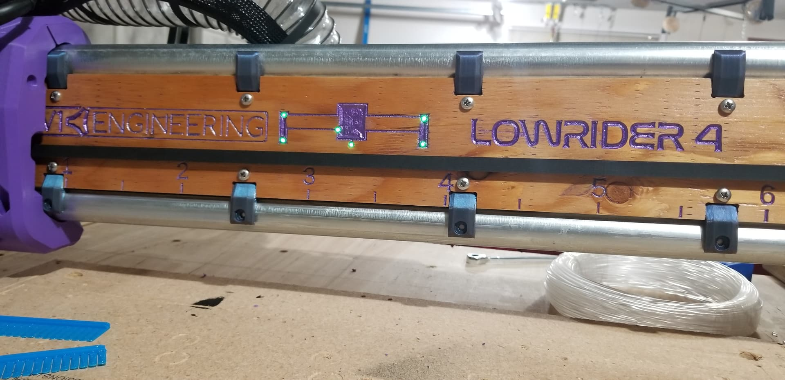
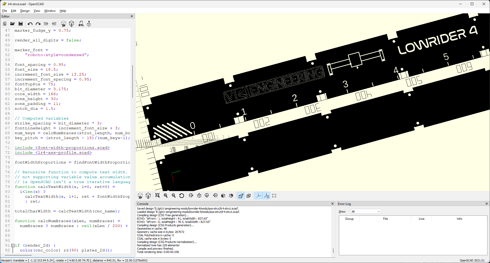

# V1E LowRider 4 mod - Create Custom Front Grill (Strut) .SVG

### Purpose
- Generate a fancy custom, but practical, stronger, solid front grill strut for your [V1Engineering LowRider 4](https://docs.v1engineering.com/lowrider) CNC.
- Honestly, I initially used this during my LR3 build as a practical opportunity to learn some [OpenSCAD](https://www.openscad.org/).  Liked the look, and created this update for LR4.

### Usage:
- See code comments for usage instructions.  For LR3, created a related video... [V1E LowRider 3 - Struts, Standard or Custom sized (OpenSCAD)](https://youtu.be/qWSuumLGRdI).

### Notes:
Written/tested on Windows.  Might work on Linux/Mac too, good luck! :-)

### Acknowledgements
- Remix/based-on Jamie's LR4 Strut generator... https://vector76.github.io/Web_OpenSCAD_Customizer/strut_plate.html

## License/Sources
You are required to listen to [Nelly Grillz](https://www.youtube.com/watch?v=8fijggq5R6w) while reading this file.

This work is licensed under a [Creative Commons (4.0 International License)
Attribution—Noncommercial—Share Alike](http://creativecommons.org/licenses/by-nc-sa/4.0/)

/v1e/... files are from https://www.v1engineering.com/logos and https://docs.v1engineering.com/.  Using per https://www.v1engineering.com/license/ which was shared under [Creative Commons Attribution-NonCommercial-ShareAlike 4.0 International License](https://creativecommons.org/licenses/by-nc-sa/4.0/).
