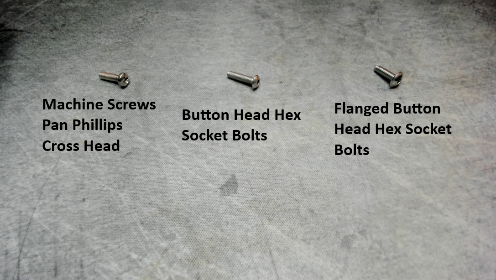

# V1E LowRider 4 mod - Pad for Belt Holder Adjustment Screws

**Problem:**  Observed endstop swing arms being able to sneak behind _Front Belt Holder Adjustment Screws_ during less than perfect homing scenarios, which are very common when first getting set up, and when things go pear shaped.

**Fix:**  
- Switch to _Button Head_ instead of stock _Pan Head_ bolts.  Do not use _Flanged Button Head_ bolts.  Reason is that the stock _Pan Head_ have a curved profile that endstop swing arms can sneak behind. 
  

- Consider using some number of M3 washers behind head of the adjustment screw so there's no gap for the swing arm to sneak behind, or, consider these printable parts:
  - [y_belt_min_pad.stl](./y_belt_min_pad.stl)
  - [y_belt_max_pad.stl](./y_belt_max_pad.stl)

  Am personally using these spacer pads for now, BUT, this requires I calibrate and configure FluidNC Pulloff distance values so that XY motion is not skewed.  
  
  My setup also has strips of 3.5" x 3/4" ply runners that were clamped and shifted around until I was happy with XY being square.  All of this is to say that I didn't mind the pads effectively being a 3mm washer.

<table>
<tr>
<td>

uxcell M3x10mm Machine Screws Pan Phillips Cross Head Screw 304 Stainless Steel Fasteners Bolts 100Pcs
https://www.amazon.com/gp/product/B07MF3RN7M

</td>
<td>

</td>
</tr>
<tr>
<td>

M3 x 10mm Thread Pitch 0.5 mm Stainless Steel 304 Hex Socket Button Head
https://www.amazon.com/iExcell-Stainless-Socket-Button-Screws/dp/B08H2HSPQD

</td>
<td>

</td>
</tr>

<tr>
<td>

M3-0.5 x 10mm Flanged Button Head Socket Cap Screw Bolts, 304 Stainless Steel 18-8, Allen Socket Drive, Bright Finish, Fully Threaded, Pack of 100
https://www.amazon.com/gp/product/B08CC6VDN1

</td>

<td>

</td>
</tr>
</table>

# Related info

https://forum.v1e.com/t/azas-lr4/45696/7?u=azab2c