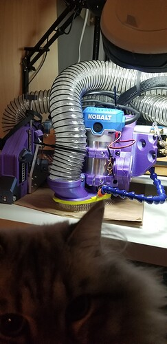

# V1E LowRider 4 Kinematic mount and adaptors mods by Doug, Jamie, Jonathan and others... 

<mark>**IN-PROGRESS, STUFF WILL CHANGE...  I STARTED MAKING KINEMATIC MOUNT BASE COOLING/MISTING SETUP.  BUT THEN, AFTER BEING MOSTLY DONE, I DECIDED TO PIVOT AND USE MODIFIED DUST SHOE INSTEAD. 🤦‍♂️**</mark>

## Summary
Doug, Jamie, Jonathan and probably others created/remixed magnetic [Kinematic coupler](https://en.wikipedia.org/wiki/Kinematic_coupling#Maxwell_coupling) adapter mounts.  Read Doug's topic for details and updates on V1E forum [LowRider v3 CNC - Tool-less KINEMATIC Accessory Holder for LowRider 3 CNC 4.0](https://forum.v1e.com/t/lowrider-v3-cnc-tool-less-kinematic-accessory-holder-for-lowrider-3-cnc-4-0/38307).

Personally created some mounts for LR3...  Models on [Printables](https://www.printables.com/model/419594-v1e-lowrider-3-pen-drag-knife-mount-and-adaptor), discussion on [V1E Forum](https://forum.v1e.com/t/lr3-mod-pen-drag-bit-knife-mount-and-adaptor/37182).  However, since LR4 Router Mount has changed, this is a good opportunity for me (and probably others) to try out the Kinematic Mount Doug created/shared and others are using/remixing.

## Purpose / Problem

My goal is to mill harder materials faster, while maximizing how long the mill end bits last.

Initially started looking at Doug et al. Kinematic Mount for adding a mist spray attachment.

Created these notes because it took me a while to muddle through various options and remixes.  So, have listed the hardware and printed parts used for my LR4(s)...

The Kinematic Mount can be used with various adapters, enabling various tasks.  Currently planning to use the Kinematic Mount for anything but misting given the Usable X gets reduced, and partly because of weight/hardware.  Ended up trying different approach, see [../mist-cooling/README.md](../mist-cooling/README.md).

## Hardware

- Qty 12 M3 x 16mm button head
- Qty 2??? M4 x 16mm Machine/Tapered head

## Printed parts
**2024/10/28 Update: Sigh...  After almost completing assembly of the setup below, I ended up pivoting to make a more compact, lighter, less hardware option instead. Details TBD...**

- Router to Mister mount parts:
  - ~~[LowRider v4 CNC - KINEMATIC Tool-less Quick-Change Accessory Holder - supports laser, drag knife, pen, etc (v5.0)](https://www.printables.com/model/1050234-lowrider-v4-cnc-kinematic-tool-less-quick-change-a)
    - LowRider v4 CNC - KINEMATIC Tool-less Quick-Change Accessory Holder - supports laser, drag knife, pen, etc v5.0.stl
      - Filled probe hole via CAD edit, unrequired for my build.
      - Manually drilled hole for Part B's nut/bolt to recess into.
      - Manually drilled holes for M3 bolts with 3/32" bit
      - 16mm too short by 1.5mm
      - ~~Consider tapered angled recess above the bottom~~
  - [Modified mounts for Doug's kinematic LR3 accessory holder](https://www.printables.com/model/492583-modified-mounts-for-dougs-kinematic-lr3-accessory-/files)
    - Part B, Fixed Base with Mountains.stl
    - Part C, Mobile Base with Valleys.stl
  - ~~[LowRider 3 CNC - Add-on - KINEMATIC Air Mist Mount for Tool-less Quick-Change Accessory Holder](https://www.printables.com/model/560988-lowrider-3-cnc-add-on-kinematic-air-mist-mount-for)~~
    - ~~Air Mist Mount v2a-side.stl~~
- IPA Bottle holder :

## Related info
- https://forum.v1e.com/t/lowrider-v3-cnc-tool-less-kinematic-accessory-holder-for-lowrider-3-cnc-4-0/38307/201
