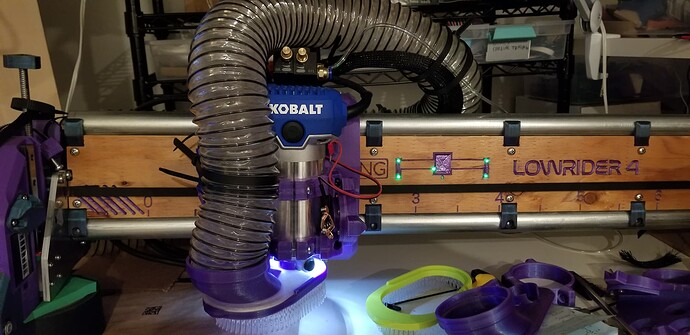
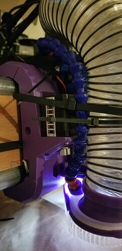
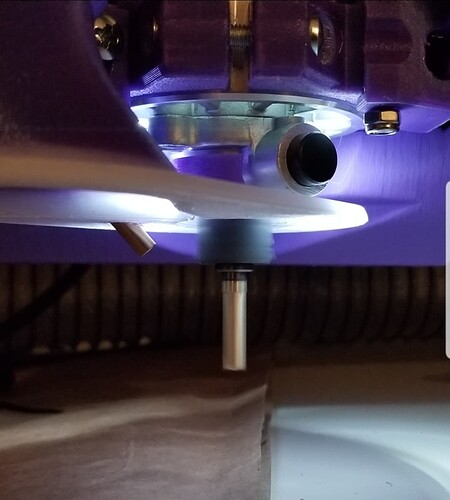
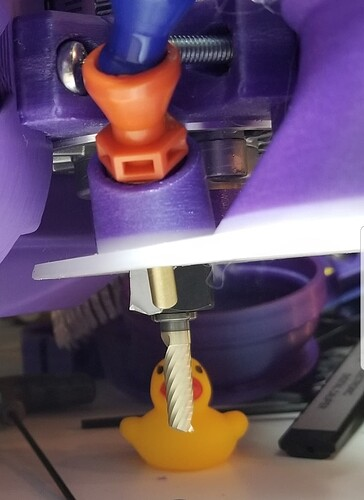

# V1E LowRider 4 Mist Cooling setup

<table><tr>
<td>

</td><td>

</td><td>

</td></tr></table>

## Summary

Notes on my cooling/misting setup.

## Purpose / Problem

## Hardware

- Mist Coolant Lubrication Spray System https://www.amazon.com/gp/product/B08XKF9QC1
- Releasable zipties 8" https://www.amazon.com/gp/product/B07R2JKWXV
- Releasable zipties 6"/8"/10"/12" https://www.amazon.com/gp/product/B07XJC8L37

## Printed parts

- [dust_shoe_kobalt-aza.stl](./dust_shoe_kobalt-aza.stl)

## Related info

- https://forum.v1e.com/t/fun-with-aluminum/39880/54?u=azab2c
