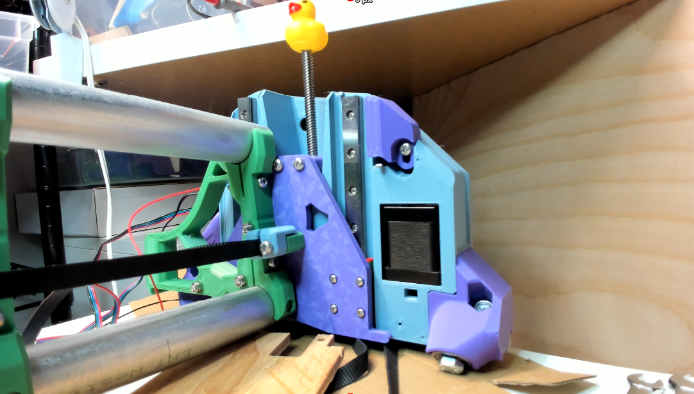
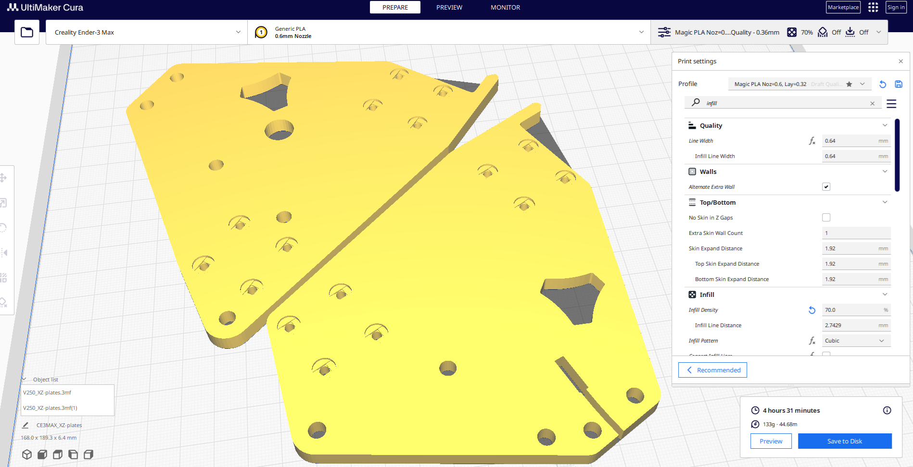

# Printable XZ Plates for LowRider 4 (Consider Alu instead)

Remix of official LR4 XZ .dxf plates. Consider [buying V1E XZ Alu Plates](https://www.v1e.com/products/lowrider-4-aluminium-xz-pl) instead of printing these.  Created and shared these for people unhappy with shipping/import costs.  Also shared on [Printables](https://www.printables.com/model/1047962-printable-xz-plates-for-lowrider-4-consider-alu-in).

## PROBLEM / PURPOSE

The sunny yellow brick road to joy and success is to buy or mill Alu Plates.  LOL, strongly recommend NOT printing this model, consider these instead:

- https://www.v1e.com/products/lowrider-4-aluminium-xz-plates

- https://www.v1e.com/products/lowrider-v3-to-lowrider-v4-hardware-upgrade-kit

If buying/making Alu isn't possible for some reason(s), then consider printing these, but then use your LR4 to mill Alu XZ plates.

That said… Since printable XZ’s are usable, but we don’t have lots of testing/feedback data yet, have posted a remix I used with recesses to help M3 bolts engage linear rail block better, includes hole features for printing plates upside down if you have a nice pattern on your print bed plate. Also, printing in that orientation may help improve flatness of the plate surface that connects to the Beam’s end braces. Again, Alu plates would be better for rigidity/strength and probably flatness. View these as temporary XZs.

Printed 70% infill, 3 walls, 3 top and bottom layers, 0.6mm nozzle.

Read https://forum.v1e.com/t/lr4-printed-xz-plates/45909 for details and updates.

Shared here, but my latest and related edits usually get backed-up/shared in github first, https://github.com/aaronse/v1engineering-mods/tree/main/lowrider4/mods/xz-plates 1

 

Please add Comments and Makes indicating whether these plates worked for you, or, ended up being a disaster that others should avoid.  Cheers!

## License/Sources
This work is licensed under a [Creative Commons (4.0 International License)
Attribution—Noncommercial—Share Alike](http://creativecommons.org/licenses/by-nc-sa/4.0/)
