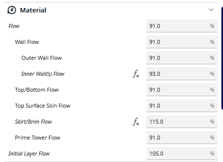

# MP3DP v4 Build Log

# TASKS

- TODO:BOM?

BOM Generator? https://forum.v1e.com/t/repeat-v2/33330/160?u=azab2c

- TODO: Print parts, file://C:\Projects(NAS)\Make.V1E_RepeatV2\models\

# ACTIONS
- 23-03-11 Created [export-components.py](scripts\export-components.py), a Fusion 360 Python script to Bulk Export MP3DPv4 parts to .STL files, and orientate exported parts ready for printing.  Shared script and [usage video](https://youtu.be/MV8f6tbj4n4) with V1E community.  Script automation will enable/encourage publishing of more-frequent design updates (i.e. Move Faster).
- 23-03-12 Start printing parts while wrapping up other projects.
  - Opened [Overture Transparent Red PETG](https://www.amazon.com/gp/product/B07YCNCZ5J)
  - Visited Teaching Tech calibration site (again) https://teachingtechyt.github.io/calibration.html#baseline
    - Created baseline cube https://teachingtechyt.github.io/calibration.html#baseline
    - https://teachingtechyt.github.io/calibration.html#flow
      - Infill Density : 55%, Wall Thickness : 1.8mm, Alternate extra wall:true, top layers: 3

      
  - Printed Test Cube to measure/verify Flow
        tech_cube_flow=100.petg.gcode
      <mark>TODO Add Clip/Photo</mark>
      Observed 0.66-0.68
      Changed flow from 100% to 91%, set brim flow to 110%.
  - https://teachingtechyt.github.io/calibration.html#retraction
  - Printed Cura Temp Tower, going with ~245

23-03-13
  - Downloaded current models https://www.printables.com/model/282346-mp3dp-v41/files

