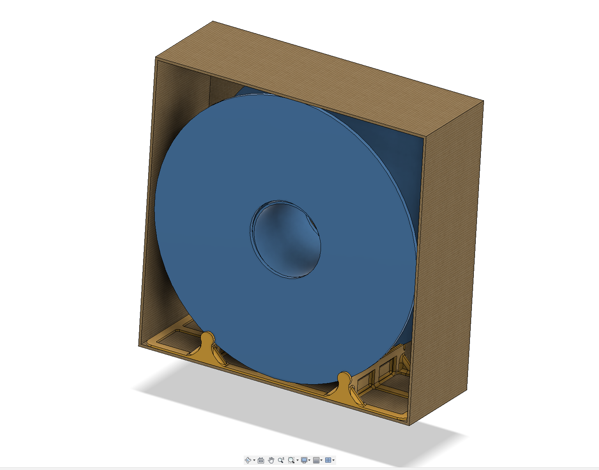
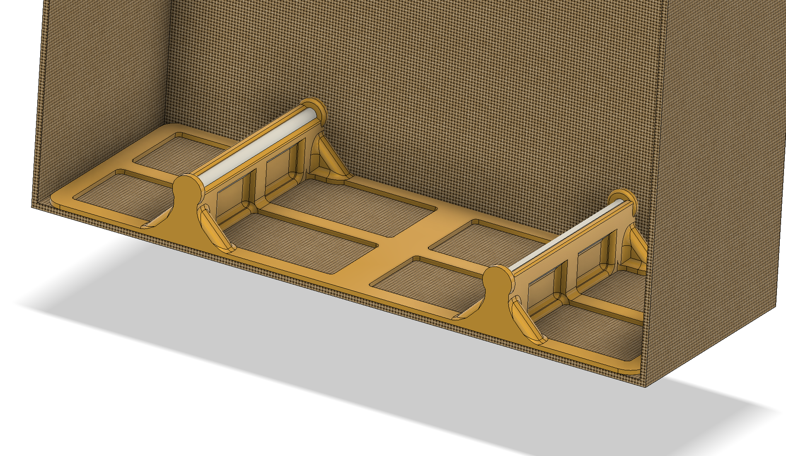
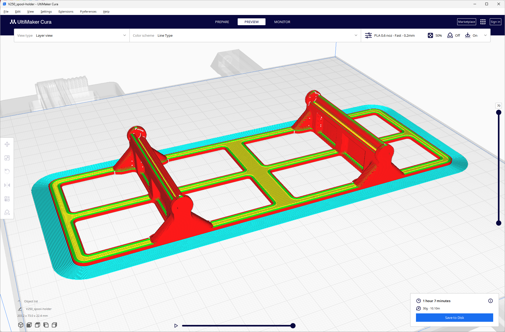

# Minimal Spool holder for mostly drybox

## GOALS
- Labor/material efficient spool holder.
- "Drybox"

## DESIGN:

- PTFE Hole 4.3mm
- Ridge/Rib should be > 2mm and > 45deg
- Calculated spool and support distances in Fusion 360.

## RELATED WORK

- https://www.printables.com/search/models?q=spool%20holder&o=popular

- The Ultimate Spool Holder
  - {l:1205, d: 4191, v: 24,000 } 
  - https://www.printables.com/model/77791-the-ultimate-spool-holder

- Standard, XL, and XXL Self-Centering Filament Spool Holder (Compatible with All Spool Sizes)
  - { l: 608, d: 1977, v: 9453 }
  - https://www.printables.com/model/497432-standard-xl-and-xxl-self-centering-filament-spool-

- Better Voron Spool Holder 
  - {l: 26, d : 283, v: 1494}
  - https://www.printables.com/model/369877-better-voron-spool-holder

- Prusa Mini - Simple 80mm Spool Holder with PTFE slider (remix)
  - { l: 18, d: 56, v: 390 }
  - https://www.printables.com/model/378035-prusa-mini-simple-80mm-spool-holder-with-ptfe-slid

- Anycubic i3 Mega S PTFE Spool Stand 
  - {l: 7, d: 54, v: 518 }
  - https://www.printables.com/model/40868-anycubic-i3-mega-s-ptfe-spool-stand

