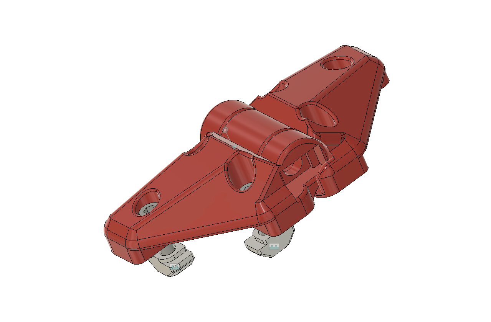
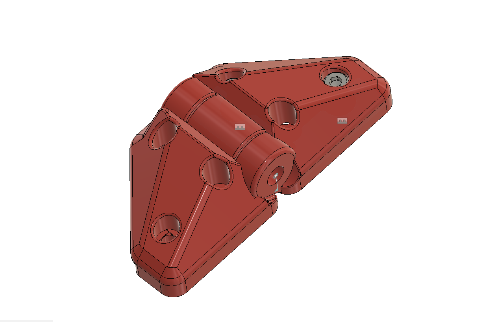

# MP3DP v4 - Panel clips, hinges and misc enclosure hardware ideas

Originally created hinge that used M3x30mm with 180 degree swing.  Noticed and fixed some [printer quality](https://forum.v1e.com/t/mp3dp-v4-azas-build/37251/227?u=azab2c), needed to reprint the hinges, so decided to create version using M5x30mm bolt with 90 degree stop.  Included both versions here, because why not...

## Version 2.0 - M5x30mm Bolt, 90 degree limit

<table><tr>
<td>

</td><td>

</td></tr></table>

## Version 1.0 -  M3x30mm Bolt, 180 degree rotation

<table><tr>
<td>

</td><td>

</td><td>

</td><td>

</td></tr></table>

Notes/links/models related to panels and enclosures.

Used :
- [SnakeOil panel clips](https://forum.v1e.com/t/mp3dp-v4-azas-build/37251/195?u=azab2c)

Related :
- Search results for '2020 hinge' on [Printables](https://www.printables.com/search/all?q=2020%20hinge), [Thangs](https://thangs.com/search/2020%20hinge?scope=all), [Yeggi](https://www.yeggi.com/q/2020+hinge/)
- [Revo Nozzle holder](https://www.printables.com/model/99012-revo-nozzle-holder-for-prusa-mk3s)

Voron enclosure models :
- [corner_panel_clip_4mm_x8.stl](https://github.com/VoronDesign/Voron-Trident/blob/main/STLs/Panels/corner_panel_clip_4mm_x8.stl)

[David Walling's](https://www.printables.com/@DavidWalling_855357) enclosure models:
- [Simple latch handle for 2020](https://www.printables.com/model/478615-simple-latch-handle-for-2020/files)
- [Simple curved drawer handle](https://www.printables.com/model/484348-simple-curved-drawer-handle/files)
- [Arducam 5MP 2020 Mount](https://www.printables.com/model/477729-arducam-5mp-2020-mount)
- [80 mm Extrusion mount for PTC heater](https://www.printables.com/model/476491-80-mm-extrusion-mount-for-ptc-heater)
- [M6 Foot for 2020](https://www.printables.com/model/476478-m6-foot-for-2020)
- [BTT 35 e3v3 Panel Mount](https://www.printables.com/model/476475-btt-35-e3v3-panel-mount)